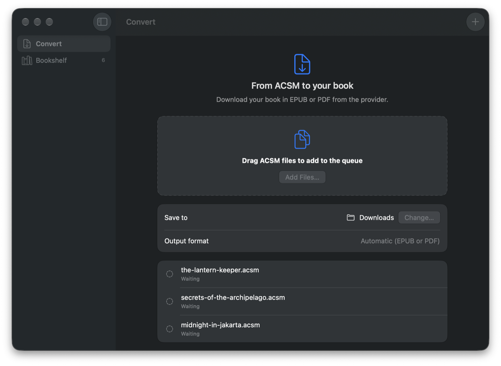
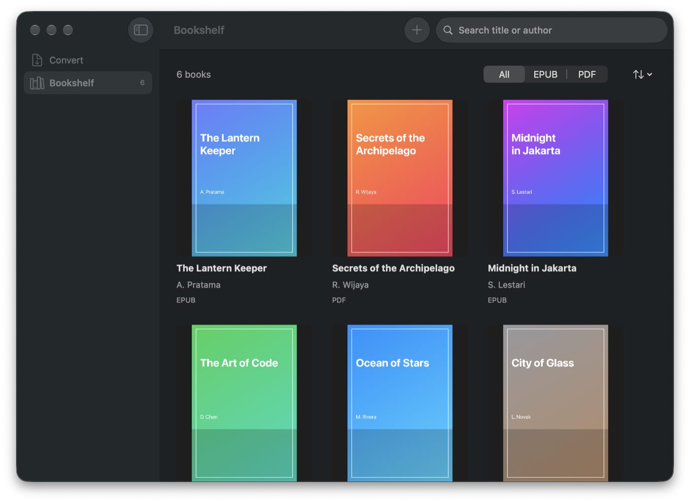

# Lentera

[](https://github.com/alvinmr/lentera/releases/latest)
[](https://github.com/alvinmr/lentera/releases/latest)
[](LICENSE)

Lentera is a native macOS app that converts Adobe ACSM license files into the EPUB or PDF file returned by the authorized book provider. It is a local alternative to Adobe Digital Editions for getting books you own into the reader you actually use.



## Features

- **Batch conversion** — drag in one or many `.acsm` files; they convert one after another, and a failed book does not stop the queue.
- **EPUB or PDF** — the provider decides the format. Lentera saves the file with the book's real title and author.
- **Local bookshelf** — converted books appear with covers, search, a format filter, and sorting. Open a book in its default app, reveal it in Finder, edit its details, or move it to the Trash.
- **Missing file detection** — books whose files were moved or deleted are flagged so you can clean up the shelf.
- **Automatic updates** — built-in [Sparkle](https://sparkle-project.org) updates keep the app current.
- **Private by design** — conversion runs entirely on your Mac through the bundled libgourou tools. Book files never pass through a third-party server.



## Download

Download the latest `Lentera-v<version>-macOS.dmg` from the [GitHub Releases](https://github.com/alvinmr/lentera/releases) page. Open it, drag `Lentera.app` onto the `Applications` shortcut, then eject the disk image and launch Lentera from Applications.

The release requires **Apple Silicon (M1 or later), macOS 14+**, and an internet connection for fulfillment. Intel Macs are not supported by this binary.

The app is ad-hoc signed and is **not Apple-notarized**. If macOS blocks it, attempt to open it once, then use **System Settings > Privacy & Security > Open Anyway** if you trust this download. Lentera does not require Homebrew or a separate runtime when using the release build.

Alternatively, install with [Homebrew](https://brew.sh) to skip the Gatekeeper prompt (Homebrew downloads are not quarantined):

```sh
brew tap alvinmr/tap
brew install --cask lentera
```

## Use

1. Open Lentera and choose **Convert**.
2. Click **Choose Files…**, or drag one or more `.acsm` files into the drop area. Double-clicking an `.acsm` file in Finder opens Lentera and adds it to the queue.
3. Choose a destination folder if `Downloads` is not suitable.
4. Click **Convert**. Files are converted one at a time; a failed book does not stop the rest of the queue. The provider determines whether each returned file is EPUB or PDF.
5. Open **Bookshelf** to find completed books. Click a book to open it, or right-click for options.

Lentera needs an ACSM file for a book you are authorized to access. An ACSM file is a license message, not the book itself; the provider and Adobe services still need to fulfill the license during conversion.

## Updates

Lentera updates itself with [Sparkle](https://sparkle-project.org). Release builds embed a signed appcast, so installed apps can use **Check for Updates…** from the application menu. Sparkle validates each update with the EdDSA signature, so an Apple Developer ID certificate is not required; the app is ad-hoc signed, and macOS may occasionally ask you to confirm opening Lentera after an update.

Maintainers must create the Sparkle signing key once before publishing a release:

```sh
Scripts/setup-sparkle.sh
```

The wizard downloads Sparkle's tools into `.sparkle-tools/` (git-ignored), stores the private key in your login Keychain, writes `SUPublicEDKey` into `Support/Info.plist`, and sets the `SPARKLE_PRIVATE_KEY` GitHub Actions secret. Commit the Info.plist change. Each release then publishes a signed `appcast.xml` that the app reads from `https://github.com/alvinmr/lentera/releases/latest/download/appcast.xml`.

## Build From Source

### Requirements

- macOS 14 or later
- Xcode 26 or later with Swift 6.2+
- CMake (`brew install cmake`) for the engine dependencies
- A libgourou source checkout, unless the included vendor checkout is already prepared

Install CMake:

```sh
brew install cmake
```

Build the conversion engine and the app:

```sh
Scripts/build-engine.sh /path/to/libgourou
Scripts/build-app.sh
open build/Lentera.app
```

`build-engine.sh` first builds OpenSSL, curl, libzip, and pugixml from source for a macOS 14
deployment target (cached in the git-ignored `.engine-deps/`). Building against Homebrew bottles
instead would make the bundled engine require the build machine's macOS version.

If you are using the prepared `Vendor/libgourou` checkout, omit the engine path:

```sh
Scripts/build-engine.sh
Scripts/build-app.sh
```

Run the tests with:

```sh
swift test
```

The build script bundles the required dynamic libraries, embeds the Lentera app icon, and ad-hoc signs the resulting app for local use. Run `Scripts/build-dmg.sh` afterward to create a compressed DMG in `build/`; its version comes from the built app.

## Troubleshooting

- **"This ACSM file has expired."** ACSM files are time-limited. Download a fresh copy from the book provider and try again.
- **"This ACSM was already opened with another device or account."** Fulfill the license with the same authorization you used before, or download a new ACSM from the provider.
- **"The Google Play device limit has been reached."** Remove an old device authorization in your Google Play Books settings, then retry.
- **"The book provider is rate limiting requests."** Wait 5–15 minutes before trying again.
- **The book converted, but the file is not where you expect.** Lentera saves to the folder shown under **Save to** (defaults to `Downloads`) using the book's title, and appends ` 2`, ` 3`, … if a file with that name exists.
- **macOS says the app cannot be verified.** Open it once, then allow it from **System Settings > Privacy & Security**. The app is not notarized.
- **Intel Macs are not supported.** The release binary is Apple Silicon only; build from source for other setups.
- **Where is my data?** The anonymous Adobe device identity and bookshelf metadata live in `~/Library/Application Support/Lentera`. Removing the app and that folder removes everything Lentera stores.

## Automated Releases

Releases are managed by GitHub Actions with [Release Please](https://github.com/googleapis/release-please). Use Conventional Commit prefixes when committing to `main`:

- `fix:` increments the patch version (`0.1.0` → `0.1.1`)
- `feat:` increments the minor version (`0.1.0` → `0.2.0`)
- `feat!:` or `BREAKING CHANGE:` increments the major version (`0.1.0` → `1.0.0`)

A push to `main` opens or updates a release PR. Merge that PR to create the tag and GitHub Release. A dependent job in the same workflow then builds the app on an Apple Silicon `macos-26` runner, packages `Lentera.app`, and uploads the versioned DMG and signed Sparkle appcast automatically.

The workflow expects the repository's default `GITHUB_TOKEN`; no personal token is required. For a release to work, the repository must have Actions enabled and CMake available on the runner.

Releases also update the Homebrew cask in `alvinmr/homebrew-tap`. That needs a token with write access to the tap, stored as the `TAP_GITHUB_TOKEN` secret; create it once with:

```sh
Scripts/setup-tap-token.sh
```

Without the secret, releases still publish and the cask update is skipped with a warning.

You can also run **Actions > Release > Run workflow** to verify a build without publishing a new version. The DMG is available as a workflow artifact. GitHub Actions must be allowed to create pull requests under **Settings > Actions > General > Workflow permissions**.

## Privacy

Book files are processed locally. Lentera contacts Adobe and the book provider only through libgourou to fulfill and download the ACSM license. The anonymous ADEPT device identity is stored at `~/Library/Application Support/Lentera/adept` so retries can use the same device.

## Third-party source

The matching libgourou and uPDFParser source and licenses are included under `Vendor/libgourou` in the repository.

## Legal

The app's own source is MIT licensed (see `LICENSE`). The bundled conversion engine builds on libgourou, which is LGPL-3.0; the vendored source and license ship in `Vendor/libgourou` and the license is also included in the app bundle. Use Lentera only for books you are authorized to access and where local law permits format shifting.
